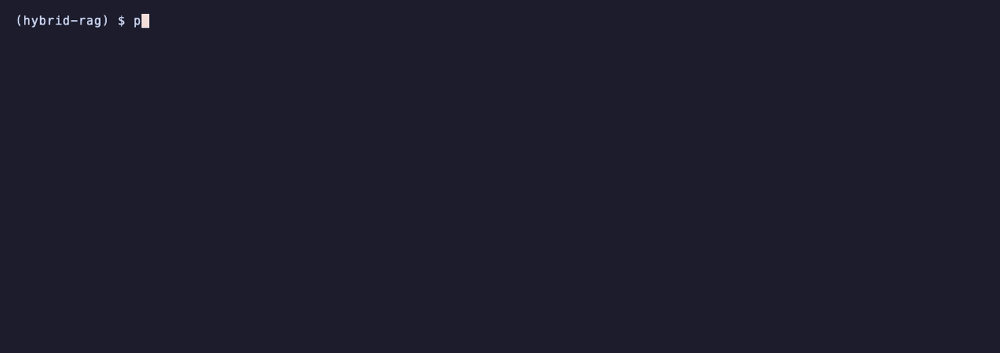

<h1 align="center">Hybrid RAG</h1>

<p align="center">
  <em>Production hybrid retrieval built from scratch: BM25 and a TF-IDF vector retriever, fused and reranked, with a rigorous retrieval evaluation suite.</em>
</p>

<p align="center">
  <a href="https://github.com/adeoluo/hybrid-rag/actions/workflows/ci.yml"></a>
  <a href="https://github.com/adeoluo/hybrid-rag/releases"></a>
  
  <a href="LICENSE"></a>
</p>

---

## Motivation

Most retrieval-augmented generation tutorials import an embedding model and a vector
database and call it done. This project builds the retrieval stack **from scratch** so the
mechanics are visible: BM25's ranking function, a TF-IDF vector retriever fit from the corpus,
rank fusion, reranking, and, most importantly,
the **evaluation** that tells you whether any of it works. It runs fully offline.

The thesis the project is built around: a retriever is only as good as your ability to
measure it. Every component is scored with standard information-retrieval metrics on a
labeled query set, and the pipelines are compared head to head in an ablation.

## Architecture

<p align="center">
  
</p>

<sub>Legend: amber = entry points and external systems, indigo = core logic, green = data and state, blue = validation and control, grey = observability and outputs.</sub>

Documents are split by a **chunker** and indexed once per named pipeline. The sparse
retrievers are **BM25**, **TF-IDF**, character n-grams, and exact phrase matching; a
from-scratch **neural dense retriever** ranks by cosine similarity over skip-gram word
embeddings. A query, from the CLI or a validated `/retrieve` request, runs through the chosen
pipeline: a single retriever, or several whose rankings are merged by **reciprocal rank
fusion**, optionally followed by a **reranker** (lexical overlap or MMR). The **evaluation
harness** scores every pipeline on labeled queries (recall@k, precision@k, MRR, nDCG), a paired
bootstrap compares two pipelines, and every route records latency and errors for `/metrics`.
See the [ADRs](docs/adr/) for key choices.

### Components

- **Chunking**: five strategies: `FixedTokenChunker` (overlapping windows),
  `SentenceChunker`, `RecursiveChunker` (separator priority), and `ParagraphChunker`.
- **Retrievers (5)**: Okapi `BM25Retriever`, a `TfidfRetriever`, a
  typo-robust `CharNgramRetriever` (character n-grams), an exact-match `PhraseRetriever`,
  and the fusing `HybridRetriever`.
- **Query processing**: `SynonymExpander` and pseudo-relevance feedback (`expand_with_prf`)
  to improve recall before retrieval runs.
- **Hybrid fusion**: reciprocal rank fusion of any set of retrievers (combines ranks, not
  incomparable scores).
- **Reranking**: a cross-encoder-style `LexicalOverlapReranker`, an `MMRReranker` for
  diversity, and a `RerankedRetriever` that composes retrieve-then-rerank into one retriever.
- **RAG**: `build_context` assembles cited, budget-bounded context with snippet
  highlighting; `ChunkStore` persists a chunked corpus to disk.
- **Evaluation**: recall@k, precision@k, MRR, MAP, DCG/nDCG, success@k, R-precision, an
  aggregating harness, and `compare_retrievers` with a paired-bootstrap significance test.

## Results

> Reproduce with `python -m hybrid_rag ablate`. Metrics averaged over 15 labeled queries at k=5.

| Pipeline | recall@5 | precision@5 | MRR | nDCG@5 |
|---|---:|---:|---:|---:|
| `bm25` | 1.000 | 0.200 | 0.967 | 0.975 |
| `tfidf` | 1.000 | 0.200 | 0.967 | 0.975 |
| `dense` | 1.000 | 0.200 | 0.933 | 0.951 |
| `hybrid` | 1.000 | 0.200 | 0.967 | 0.975 |
| `dense-hybrid` | 1.000 | 0.200 | 0.967 | 0.975 |
| `reranked` | 1.000 | 0.200 | 0.967 | 0.975 |
| `hybrid-all` | 1.000 | 0.200 | 0.967 | 0.975 |
| `mmr` | 1.000 | 0.200 | 0.947 | 0.959 |

The pipelines are measured identically on the same labeled queries. Each query has a
single relevant chunk, so precision@5 is capped at 0.200 (one correct result out of five
positions) and is identical across pipelines; it is reported for completeness rather than as
a differentiator on this corpus. Every pipeline recovers the relevant chunk (recall 1.000),
so the differences that remain are in **ranking quality** (MRR and nDCG).

### What the neural dense retriever shows (an honest result)

The `dense` pipeline is a **from-scratch neural retriever**: it trains word embeddings with a
skip-gram objective and negative sampling over the indexed corpus (with the training loop and
gradients written by hand), represents each chunk and query as the mean of its word vectors, and
ranks by cosine similarity. It is the "real neural embeddings" baseline the lexical methods are measured
against.

The honest finding is that on this small corpus the learned dense retriever **does not beat the
strong lexical baselines**: it still recovers every relevant chunk (recall 1.000) but ranks it
slightly lower on average (**MRR 0.933 versus 0.967**). This is expected and informative, not a
bug: learning dense semantics that outranks exact lexical matching needs far more training data
than a few short passages provide, where a single shared term is a very strong and precise
signal. Fusing the dense retriever with the lexical ones (`dense-hybrid`) recovers the lexical
ranking (MRR 0.967), so the dense signal does not hurt in combination. The value here is a
correct, measured, from-scratch implementation of dense retrieval, compared fairly against
lexical retrieval rather than assumed to beat it. See [limitations](#limitations) for why the
methods converge at this corpus scale.

### Scale

`benchmarks/scale.py` runs the flagship `hybrid` pipeline (BM25 + TF-IDF fusion)
over progressively larger synthetic chunk corpora and a fixed 80-query set,
reporting wall-clock time, query throughput, peak memory (stdlib `tracemalloc`,
measured in a separate pass so the per-allocation hook does not distort timing),
and recall@5 against one planted relevant chunk per query. Measured on this
machine (`uv run python benchmarks/scale.py`):

| Chunks | Seconds | Queries/sec | Peak MiB | recall@5 |
|---:|---:|---:|---:|---:|
| 500 | 1.35 | 67 | 2.3 | 0.53 |
| 1,000 | 2.04 | 45 | 4.6 | 0.38 |
| 2,000 | 5.87 | 17 | 9.1 | 0.31 |
| 4,000 | 10.07 | 9 | 18.3 | 0.21 |

Throughput falls faster than linearly because fusion scores every chunk with each
sub-retriever, and recall decays as the field of random distractors grows. These
numbers are from synthetic data on this Python implementation (its TF-IDF is a
classical sparse lexical retriever by design, not neural); they are **not** a
comparison against production vector databases or compiled indexes, which would be
far faster and are the right tool at real scale.

### Performance

> Measured over a 500-chunk synthetic corpus and 200 queries (`uv run python benchmarks/benchmark.py`).

| Pipeline | Index build (ms) | Queries / sec |
|---|---:|---:|
| `bm25` | 4.5 | 1,696 |
| `tfidf` | 8.7 | 2,241 |
| `hybrid` | 13.2 | 940 |
| `reranked` | 12.9 | 819 |
| `hybrid-all` (4-way fusion) | 47.6 | 330 |
| `mmr` (diversity) | 13.0 | 518 |

All retrieval is in-process and in-memory, so hundreds to thousands of queries per second
require no external service.

## Quickstart

```bash
git clone https://github.com/adeoluo/hybrid-rag.git && cd hybrid-rag
make setup                    # install dev tooling + pre-commit hooks
make all                      # lint + type-check + test

# evaluate every pipeline on the bundled labeled queries
python -m hybrid_rag ablate --k 3

# retrieve over the bundled corpus
python -m hybrid_rag query "how do plants make energy from sunlight" --pipeline hybrid
```

Use the library directly:

```python
from hybrid_rag.core import FixedTokenChunker, chunk_documents, Document
from hybrid_rag.retrievers import BM25Retriever, TfidfRetriever, HybridRetriever

chunks = chunk_documents([Document(id="d", text="...")], FixedTokenChunker())
retriever = HybridRetriever([BM25Retriever(), TfidfRetriever()])
retriever.index(chunks)
results = retriever.retrieve("my query", k=5)
```

## Usage

A real run: a hybrid query with fused scores, then the retrieval ablation across eight pipelines. Regenerate with `vhs docs/demo/query.tape`.

<p align="center">
  
</p>

### HTTP service

A standard-library HTTP service indexes every pipeline once at startup and serves retrieval:

```bash
python -m hybrid_rag serve --port 8000

curl localhost:8000/health
curl -s -X POST localhost:8000/retrieve -d '{"query": "neural networks", "pipeline": "hybrid", "k": 5}'
```

`GET /health` lists the pipelines and chunk count; `POST /retrieve` returns ranked chunks
with scores for a chosen pipeline, so the latency-for-quality tradeoff is selectable per
request. A production-style stress benchmark (`uv run python benchmarks/stress.py`) reports
throughput and p50/p95/p99 latency per pipeline, making that tradeoff concrete; the service
is scaled with processes because the CPU-bound Python handler is limited by the global interpreter
lock. The service also exposes `GET /ready` (readiness) and `GET /metrics` (per-route request, error,
and latency metrics in Prometheus text format). See the [operations guide](docs/OPERATIONS.md), the
[scaling and tradeoffs](docs/SCALING.md) document, and the [case study](docs/CASE_STUDY.md) on choosing a pipeline under a budget.

### Demos

Recorded from real runs with [vhs](https://github.com/charmbracelet/vhs); each tape is in `docs/demo/`.

The same query through three retrieval pipelines.

<p align="center">
  
</p>

## Design decisions

- **Reciprocal rank fusion, not score addition.** BM25 and cosine scores are on
  incomparable scales; fusing ranks is robust and parameter-light.
  ([ADR-0002](docs/adr/0002-reciprocal-rank-fusion.md))
- **Fit the TF-IDF weights from the corpus.** The idf weights are computed at index time,
  so the retriever is corpus-specific; it is a sparse lexical method, not a neural dense embedding.
  ([ADR-0003](docs/adr/0003-tfidf-retriever.md))
- **Evaluation is a first-class component**, not an afterthought: the project ships the
  metrics and the harness, and every claim is a reproducible number.

## Testing

```bash
make test                    # uv run pytest
uv run pytest -m "not slow"   # the CI selection, without full-pipeline training runs
make lint type               # ruff format check, ruff lint, mypy
```

The suite in `tests/` covers tokenization and every chunker (`test_core.py`, `test_query_chunking.py`), each retriever including BM25, TF-IDF, character n-gram, phrase, and the from-scratch neural dense retriever (`test_retrievers.py`, `test_more_retrievers.py`, `test_dense.py`), reciprocal rank fusion, reranking, and MMR (`test_fusion_rerank.py`), the retrieval metrics and evaluation harness (`test_evaluation.py`), paired-bootstrap retriever comparison (`test_comparison.py`), RAG context assembly and chunk persistence (`test_rag_persistence.py`), the command-line interface (`test_cli.py`), and the HTTP handler layer (`test_service.py`).

Tests marked `slow` train every pipeline end to end, including the neural dense retriever; they are excluded from CI and reproduced by the CLI and benchmarks. CI runs ruff format, ruff lint, mypy, and `pytest -m "not slow"` with an 80% coverage gate on Python 3.11 and 3.12, then builds the package and the Docker image.

## Responsible AI

- **Model card:** [docs/MODEL_CARD.md](docs/MODEL_CARD.md)
- **Data card:** [docs/DATA_CARD.md](docs/DATA_CARD.md)
- **Threat model:** [docs/THREAT_MODEL.md](docs/THREAT_MODEL.md)

## Limitations

- The TF-IDF retriever is sparse and lexical, sharing vocabulary with BM25; it cannot match
  paraphrases with no lexical overlap. True semantic retrieval needs neural embeddings
  (a deliberate boundary to keep every retriever from scratch and inspectable).
- Because both retrievers are lexical, they converge on the clean bundled corpus; the
  value here is the measurement framework, which would expose differences on a harder or
  semantically-phrased query set.
- The bundled corpus is a demonstration, not a competitive benchmark.

## Roadmap

- [ ] Optional neural embedding retriever behind the same `Retriever` interface
- [ ] Query expansion and pseudo-relevance feedback
- [ ] Persistent on-disk index for larger corpora

## License

Released under the [MIT License](LICENSE).
